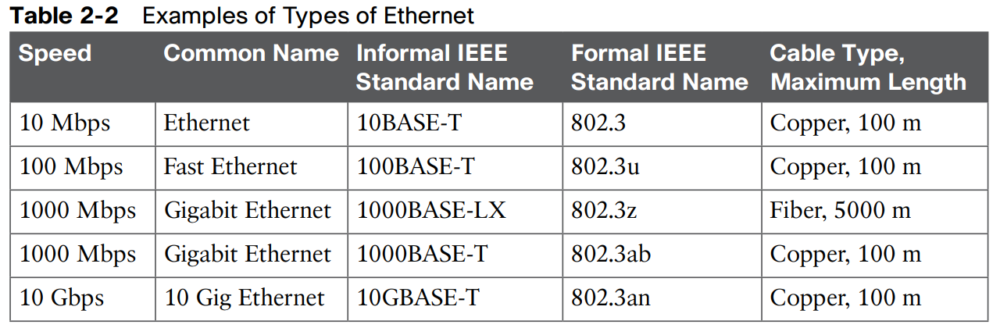
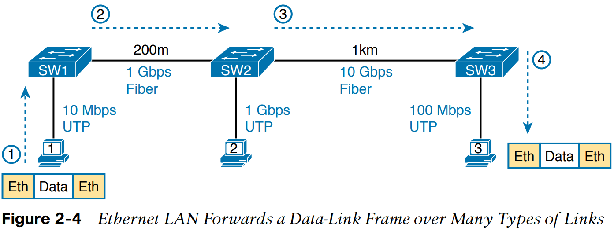
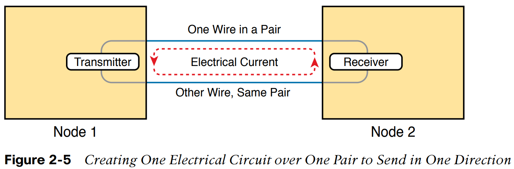

# CCNA 200-301 Vol 1 - Chapter 1

## Chapter 1 - introduction to TCPIP Networking
1- D / F  
2- A / G  
3- B  
4- B  
5- A  
6- D  
7- A  

1. Which of the following protocols are examples of TCP/IP transport layer protocols?  
(Choose two answers.)  
a. Ethernet  
b. HTTP  
c. IP  
d. UDP  
e. SMTP  
f. TCP

2. Which of the following protocols are examples of TCP/IP data-link layer protocols?  
(Choose two answers.)  
a. Ethernet  
b. HTTP  
c. IP  
d. UDP  
e. SMTP  
f. TCP  
g. PPP  

3. The process of HTTP asking TCP to send some data and making sure that it is received correctly is an example of what?  
a. Same-layer interaction  
b. Adjacent-layer interaction  
c. OSI model  
d. All of these answers are correct.  

4. The process of TCP on one computer marking a TCP segment as segment 1, and the receiving computer then acknowledging the receipt of TCP segment 1 is an example of  
what?  
a. Data encapsulation  
b. Same-layer interaction  
c. Adjacent-layer interaction  
d. OSI model  
e. All of these answers are correct.  

5. The process of a web server adding a TCP header to the contents of a web page, followed by adding an IP header and then adding a data-link header and trailer, is an  
example of what?  
a. Data encapsulation  
b. Same-layer interaction  
c. OSI model  
d. All of these answers are correct.  

6. Which of the following terms is used specifically to identify the entity created when encapsulating data inside data-link layer headers and trailers?  
a. Data  
b. Chunk  
c. Segment  
d. Frame  
e. Packet  

7. Which OSI encapsulation term can be used instead of the term frame?  
a. Layer 1 PDU  
b. Layer 2 PDU  
c. Layer 3 PDU  
d. Layer 5 PDU  
e. Layer 7 PDU  

----------------------------------------------------------

Perspectives on Networking  

### Small Office/Home Office (SOHO) Network:

    The cable modem then connects to a cable TV (CATV) outlet in the wall using a round 'coaxial cable'  
    wireless local-area network (wireless LAN), or Wi-Fi  

### Enterprise Network

## TCP/IP Networking Model:

### Overview of the TCP/IP Networking Model :
    Overview of the TCP/IP Networking Model:  
    The TCP/IP model both defines and references a large collection of protocols that allow computers to communicate. 

### RFC (Requests For Comments): 
    To define a protocol, TCP/IP uses documents called Requests For Comments (RFC).
    (You can find these RFCs using any online search engine.)

### TCP/IP Application Layer  
    the application layer provides an interface between software running on a computer and the network itself.  
    TCP/IP application layer protocols provide services to the application software running on acomputer.  
    --> The application layer does not define the application itself, but it defines SERVICES THAT APPLICATION NEED. 
    --> Exemple : WEB BROSWER  

### HTTP Overview

Figure 1-5 Basic Application Logic to Get a Web Page  

### HTTP Protocol Mechanisms
#### URL & URI
    URL -> Uniform Resource Locators   
    URI -> Universal Resource Identifiers (URI)—begins  

    The full version of most web addresses—also called Uniform Resource  
    Which means that HTTP is used to transfer the web pages.

### TCP/IP Transport Layer
    Transport layer protocols provide services to the application layer protocols that reside one layer higher in the TCP/IP model. 
    Transport layer protocol provide a service to a higher-layer protocol  
#### TCP :
    Transmission Control Protocol (TCP)
#### UDP :
    User Datagram Protocol (UDP)

## TCP Error Recovery Basics

##### Figure 1-7 TCP Error-Recovery Services as Provided to HTTP

## Same-Layer and Adjacent-Layer Interactions

### Same-Layer  Interactions
    Refers to the concepts of how adjacent layers in a networking model, on the same computer, work together.
    In this example, the higher-layer protocol (HTTP) wants error recovery,  
    so it uses the next lower-layer protocol (TCP) to perform the service of error recovery; the lower layer provides a service to the layer above it.  

### Adjacent-Layer Interactions

#### Internet Protocol and the Postal Service

# Internet Protocol Addressing Basics
    Each device that uses TCP/IP—each TCP/IP host—needs a unique address so that it can be identified in the network.  
    IP also defines how to group addresses together  

# IP Routing Basics
    Any device with an IP address can connect to the TCP/IP network and send packets.  

###  IP host  
    The term IP host refers to any device, regardless of size or power,  
    that has an IP address and connects to any TCP/IP network.  

    IP Routing is based on Destination  

    The TCP/IP model’s data-link and physical layers define the protocols and hardware required to deliver data across some physical network.  

    The two work together quite closely; in fact, some standards define both the data-link and physical layer functions.  

    The physical layer defines the cabling and energy (for example, electrical signals) that flow over the cables.  
    Some rules and conventions exist when sending data over the cable; however, those rules exist in the data-link layer of the TCP/IP model.  

    When a host’s or router’s IP process chooses to send an IP packet to another router or host,  
    that host or router then uses link-layer details to send that packet to the next host/router.  

##### Figure 1-11 Larry Using Ethernet to Forward an IP Packet to Router R1

##### Step 1.
    Larry encapsulates the IP packet between an Ethernet header and Ethernet trailer, creating an Ethernet frame.  
##### Step 2.
    Larry physically transmits the bits of this Ethernet frame, using electricity flowing over the Ethernet cabling.  
##### Step 3.
    Router R1 physically receives the electrical signal over a cable and re-creates the same bits by interpreting the meaning of the electrical signals.  
##### Step 4.
    Router R1 de-encapsulates the IP packet from the Ethernet frame by removing and discarding the Ethernet header and trailer.  

# Data Encapsulation Terminology

##### Figure 1-12 Five Steps of Data Encapsulation: TCP/IP

# Names of TCP/IP Messages

##### Figure 1-13 Perspectives on Encapsulation and DATA
    LH: link header 
    LT : link trailer

# OSI Networking Model and Terminology

## Comparing OSI and TCP/IP Layer Names and Numbers
    The OSI model has many similarities to the TCP/IP model from a basic conceptual perspective.

    It has layers, and each layer defines a set of typical networking functions.
    As with TCP/IP, the OSI layers each refer to multiple protocols and standards that implement the functions specified by each layer.

    In other cases, just as for TCP/IP, the OSI committees did not create new protocols or standards,

    --> Note that the TCP/IP model in use today, on the right side of the  figure, uses the exact same layer names as OSI at the lower layers.

## OSI Data Encapsulation Terminology

###### Figure 1-15 OSI Encapsulation and Protocol Data Units 

    OSI uses a more generic term to refer to messages, rather than frame, packet, and segment.  

    OSI uses the term protocol data unit (PDU).

    A PDU represents the bits that include the headers and trailers for that layer, as well as the encapsulated data.

##### For example, an IP packet: 
    As shown in Figure 1-13, using OSI terminology, is a PDU, more specifically a Layer 3 PDU (abbreviated L3PDU) because IP is a Layer 3 protocol.
    
    OSI simply refers to the Layer "X" PDU (LxPDU),
    with "X" referring to the number of the layer being discussed, as shown in Figure 1-15

