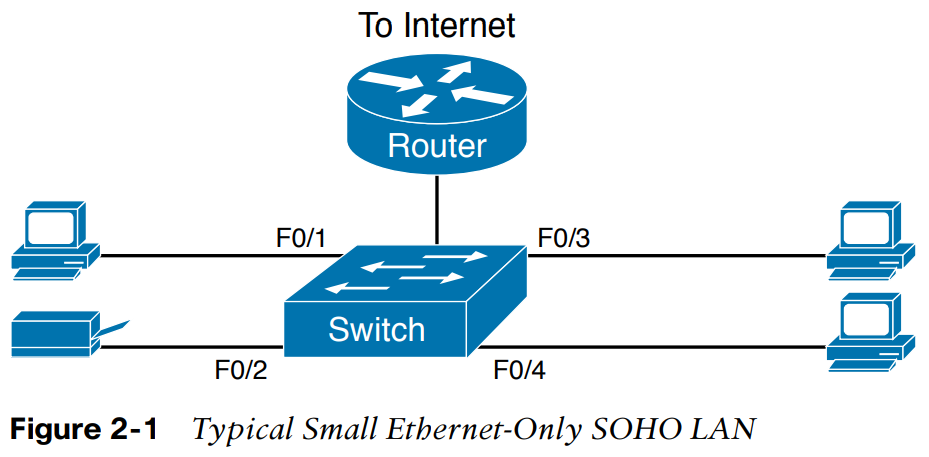

# CCNA 200-301 Vol 1 - Chapter 2

## Chapter 2 - Fundamentals of Ethernet LANs
1- C  - < A >
2- C  
3- B  
4- B & D & E
5- A  - < A >
6- B
7- A  - < C >
8- B & C  & E
9- C & D

1. In the LAN for a small office, some user devices connect to the LAN using a cable, while others connect using wireless technology (and no cable). Which of the following is true regarding the use of Ethernet in this LAN?  
a. Only the devices that use cables are using Ethernet.  
b. Only the devices that use wireless are using Ethernet.  
c. Both the devices using cables and those using wireless are using Ethernet.  
d. None of the devices are using Ethernet.  

2. Which of the following Ethernet standards defines Gigabit Ethernet over UTP cabling?  
a. 10GBASE-T  
b. 100BASE-T  
c. 1000BASE-T  
d. None of the other answers is correct.

  
3. Which of the following is true about Ethernet crossover cables for Fast Ethernet?  
a. Pins 1 and 2 are reversed on the other end of the cable.  
b. Pins 1 and 2 on one end of the cable connect to pins 3 and 6 on the other end of the cable.  
c. Pins 1 and 2 on one end of the cable connect to pins 3 and 4 on the other end of the cable.  
d. The cable can be up to 1000 meters long to cross over between buildings.  
e. None of the other answers is correct.

  
4. Each answer lists two types of devices used in a 100BASE-T network. If these devices were connected with UTP Ethernet cables, which pairs of devices would require a straight-through cable? (Choose three answers.)  
a. PC and router  
b. PC and switch  
c. Hub and switch  
d. Router and hub  
e. Wireless access point (Ethernet port) and switch

  
5. Which of the following are advantages of using multimode fiber for an Ethernet link instead of UTP or single-mode fiber?  
a. To achieve the longest distance possible for that single link.  
b. To extend the link beyond 100 meters while keeping initial costs as low as possible.  
c. To make use of an existing stock of laser-based SFP/SFP+ modules.  
d. To make use of an existing stock of LED-based SFP/SFP+ modules.

  
6. Which of the following is true about the CSMA/CD algorithm?  
a. The algorithm never allows collisions to occur.  
b. Collisions can happen, but the algorithm defines how the computers should notice  
a collision and how to recover.  
c. The algorithm works with only two devices on the same Ethernet.  
d. None of the other answers is correct.

  
7. Which of the following is true about the Ethernet FCS field?  
a. Ethernet uses FCS for error recovery.  
b. It is 2 bytes long.  
c. It resides in the Ethernet trailer, not the Ethernet header.  
d. It is used for encryption.

8. Which of the following are true about the format of Ethernet addresses? (Choose three answers.)  
a. Each manufacturer puts a unique OUI code into the first 2 bytes of the address.  
b. Each manufacturer puts a unique OUI code into the first 3 bytes of the address.  
c. Each manufacturer puts a unique OUI code into the first half of the address.  
d. The part of the address that holds this manufacturer’s code is called the MAC.  
e. The part of the address that holds this manufacturer’s code is called the OUI.  
f. The part of the address that holds this manufacturer’s code has no specific name.

  
9. Which of the following terms describe Ethernet addresses that can be used to send one frame that is delivered to multiple devices on the LAN? (Choose two answers.)  
a. Burned-in address  
b. Unicast address  
c. Broadcast address  
d. Multicast address

# An Overview of LANs
    The term Ethernet refers to a family of LAN standards that together define the physical and data-link layers of the world’s most popular wired LAN technology.

## Institute of Electrical and Electronics Engineers (IEEE)
    The standards, defined by the Institute of Electrical and Electronics Engineers (IEEE), define the cabling, 

# Typical SOHO LANs
    To begin, first think about a small office/home office (SOHO) LAN today,
    specifically a LAN that uses only Ethernet LAN technology.
    
    First, the LAN needs a device called an Ethernet LAN switch, which provides many physical ports into which cables can be connected. 
    
    An Ethernet uses Ethernet cables, which is a general reference to any cable that conforms to any of several Ethernet standards.
    
    The LAN uses Ethernet cables to connect different Ethernet devices or nodes to one of the switch’s Ethernet ports.

###### Figure 2-1 Typical Small Ethernet-Only SOHO LAN

    Typical SOHO LANs today also support wireless LAN connections.
    
    You can build a single SOHO LAN that includes both Ethernet LAN technology as well as wireless LAN technology,
    which is also defined by the IEEE.

    Wireless LANs,
    defined by the IEEE using standards that begin with 802.11,
    use radio waves to send the bits from one node to the next.

## WireLess Access Point :

    Most wireless LANs rely on yet another networking device:
    a wireless LAN access point(AP).
    
    The AP acts somewhat like an Ethernet switch, in that all the wireless LAN nodes communicate with the wireless AP.
    
    If the network uses an AP that is a separate physical device,
    the AP then needs a single Ethernet link to connect the AP to the Ethernet LAN, as shown in Figure 2-2.

###### Figure 2-2 Typical Small Wired and Wireless SOHO LAN

    Ethernet supports a large variety of options for physical Ethernet links given its long history over the last 40 or so years.

    Today, Ethernet includes many standards for different kinds of optical and copper cabling, and for speeds from 10 megabits per second (Mbps) up to 400 gigabits per second (Gbps).

    The standards also differ as far as the types and length of the cables.

    The most fundamental cabling choice has to do with the materials used inside the cable for the physical transmission of bits:
    either copper wires or glass fibers.

    Devices using UTP cabling transmit data over electrical circuits via the copper wires inside the cable.

# Fiber Optic :
    Fiber-optic cabling, the more expensive alternative, allows Ethernet nodes to send light over glass fibers in the center of the cable.

    Fiber-optic cabling contains long thin strands of fiberglass.
    The attached Ethernet nodes send light over the glass fiber in the cable,
    
    encoding the bits as changes in the light.

    Although more expensive, optical cables typically allow longer cabling distances between nodes.

###### Table 2-2 Examples of Types of Ethernet

##  FRAME 
    Frame specifically refers to the header and trailer of a data-link protocol, plus the data encapsulated inside that header and trailer.

###### Figure 2-4 Ethernet LAN Forwards a Data-Link Frame over Many Types of Links

# Ethernet LAN
    It is a combination of user devices, LAN switches, and different kinds of cabling. Each link can use different types of cables, at different speeds.

    However, they all work together to deliver Ethernet frames from the one device on the LAN to some other device.

#  Unshielded Twisted Pair (UTP)

## Building Physical Ethernet LANs with UTP

##### Most commonly used Ethernet standards:
        10BASE-T (Ethernet)
        100BASE-T (Fast Ethernet, or FE),
        1000BASE-T (Gigabit Ethernet, or GE)

### Transmitting Data Using Twisted Pairs

