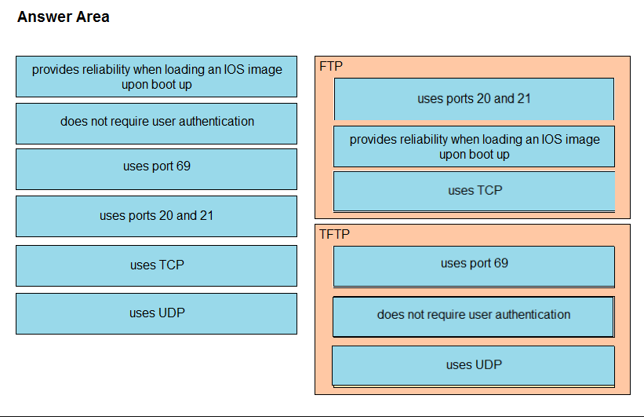

  
# CISOC - CCNA 200-301 - Exam  
  
  
  
## ExamTopics  
### https://www.examtopics.com/exams/cisco/200-301/view/1  
---------------------------------------------------  
  

  
Question #1

Refer to the exhibit. Which type of route does R1 use to reach host 10.10.13.10/32?  

  

A. default route  
B. network route  
C. host route  
D. floating static route  

  

    
📘 Explanation

Réf:  
https://www.econfigs.com/ccna-3-8-b-network-route/  
A network route is used to route traffic to a specific network.  
The network mask in a network route cannot be /0 (default route) or /32 (host route).  
  

  

    
🌟 Correct Answer

    ✅ B
  

---

  
Question #2

Refer to the exhibit. Which prefix does Router1 use for traffic to Host A?  

  

A. 10.10.10.0/28  
B. 10.10.13.0/25  
C. 10.10.13.144/28  
D. 10.10.13.208/29  

  

    
📘 Explanation

👉 Ici vous pouvez insérer l’explication du calcul de masque et du choix de la plage correspondante.  
  

  

    
🌟 Correct Answer

    ✅ D
  

---

  
Question #3

Drag and drop the IPv4 network subnets from the left onto the correct usable host ranges on the right. Select and Place:  

  

  

    
📘 Explanation

👉 Ajoutez ici les explications du mapping entre subnets et plages d’adresses.  
  

  

    
🌟 Correct Answer

    ✅  
  
  

---

  
Question #4

A frame that enters a switch fails the Frame Check Sequence. Which two interface counters are incremented? (Choose two.)  

A. input errors  
B. frame  
C. giants  
D. CRC  
E. runts  

  

    
📘 Explanation

    👉 input errors s’incrémente → c’est un compteur global qui inclut toutes les erreurs d’entrée (CRC, runt, giant, etc.).  
    CRC s’incrémente → car une trame qui échoue au FCS est comptée comme une erreur CRC.  
  

  

    
🌟 Correct Answer

    ✅ A, D
  

---

  
Question #5

DRAG DROP
Drag and drop the IPv4 network subnets from the left onto the correct usable host ranges on the right.
Select and Place:

  

    
🌟 Correct Answer

    ✅ 
  

  

---

  
Question #6

  How do TCP and UDP differ in the way that they establish a connection between two endpoints?  
  
A. TCP uses the three-way handshake, and UDP does not guarantee message delivery.  
B. TCP uses synchronization packets, and UDP uses acknowledgment packets.  
C. UDP provides reliable message transfer, and TCP is a connectionless protocol.  
D. UDP uses SYN, SYN ACK, and FIN bits in the frame header while TCP uses SYN, SYN ACK, and ACK bits.  

  

    
📘 Explanation

  A. TCP uses the three-way handshake, and UDP does not guarantee message delivery.  
  

  

    
🌟 Correct Answer

    ✅ A  
  

---

  
Question #7

Which 802.11 frame type is Association Response?  
A. management  
B. protected frame  
C. action  
D. control  

  

    
📘 Explanation

👉 
Les trames Association Request et Association Response appartiennent à la catégorie des management frames dans la norme IEEE 802.11.
Elles servent à établir l’association entre une station (STA) et un point d’accès (AP).

📖 Référence officielle IEEE / Cisco :

Cisco Docs – 802.11 Frame Types : https://www.cisco.com/c/en/us/support/docs/wireless-mobility/80211/21391-80211.html
  

  

    
🌟 Correct Answer

    ✅ A  
  

---

  
Question #8

In which way does a spine-and-leaf architecture allow for scalability in a network when additional access ports are required?  

A. A spine switch and a leaf switch can be added with redundant connections between them.  
B. A spine switch can be added with at least 40 GB uplinks.  
C. A leaf switch can be added with connections to every spine switch.  
D. A leaf switch can be added with a single connection to a core spine switch.  

  

    
📘 Explanation

👉 

  

  

    
🌟 Correct Answer

    ✅ A B C D E
  

---

  
Question #N?

Question ici !

  

    
📘 Explanation

👉 Ajoutez ici
  

  

    
🌟 Correct Answer

    ✅ A B C D E
  

---

  
Question #N?

Question ici !

  

    
📘 Explanation

👉 Ajoutez ici
  

  

    
🌟 Correct Answer

    ✅ A B C D E
  

---

  
Question #N?

Question ici !

  

    
📘 Explanation

👉 Ajoutez ici
  

  

    
🌟 Correct Answer

    ✅ A B C D E
  

---

  
Question #N?

Question ici !

  

    
📘 Explanation

👉 Ajoutez ici
  

  

    
🌟 Correct Answer

    ✅ A B C D E
  

---

  
Question #N?

Question ici !

  

    
📘 Explanation

👉 Ajoutez ici
  

  

    
🌟 Correct Answer

    ✅ A B C D E
  

---

  
Question #N?

Question ici !

  

    
📘 Explanation

👉 Ajoutez ici
  

  

    
🌟 Correct Answer

    ✅ A B C D E
  

---

  
Question #N?

Question ici !

  

    
📘 Explanation

👉 Ajoutez ici
  

  

    
🌟 Correct Answer

    ✅ A B C D E
  

---

  
Question #N?

Question ici !

  

    
📘 Explanation

👉 Ajoutez ici
  

  

    
🌟 Correct Answer

    ✅ A B C D E
  

---

  
Question #N?

Question ici !

  

    
📘 Explanation

👉 Ajoutez ici
  

  

    
🌟 Correct Answer

    ✅ A B C D E
  

---

  
Question #N?

Question ici !

  

    
📘 Explanation

👉 Ajoutez ici
  

  

    
🌟 Correct Answer

    ✅ A B C D E
  

---

  
Question #N?

Question ici !

  

    
📘 Explanation

👉 Ajoutez ici
  

  

    
🌟 Correct Answer

    ✅ A B C D E
  

---

  
Question #N?

Question ici !

  

    
📘 Explanation

👉 Ajoutez ici
  

  

    
🌟 Correct Answer

    ✅ A B C D E
  

---

  
Question #N?

Question ici !

  

    
📘 Explanation

👉 Ajoutez ici
  

  

    
🌟 Correct Answer

    ✅ A B C D E
  

---

  
Question #N?

Question ici !

  

    
📘 Explanation

👉 Ajoutez ici
  

  

    
🌟 Correct Answer

    ✅ A B C D E
  

---

  
Question #N?

Question ici !

  

    
📘 Explanation

👉 Ajoutez ici
  

  

    
🌟 Correct Answer

    ✅ A B C D E
  

---

  
Question #N?

Question ici !

  

    
📘 Explanation

👉 Ajoutez ici
  

  

    
🌟 Correct Answer

    ✅ A B C D E
  

---

  
Question #N?

Question ici !

  

    
📘 Explanation

👉 Ajoutez ici
  

  

    
🌟 Correct Answer

    ✅ A B C D E
  

---

  
Question #N?

Question ici !

  

    
📘 Explanation

👉 Ajoutez ici
  

  

    
🌟 Correct Answer

    ✅ A B C D E
  

---

  
Question #N?

Question ici !

  

    
📘 Explanation

👉 Ajoutez ici
  

  

    
🌟 Correct Answer

    ✅ A B C D E
  

---

  
Question #N?

Question ici !

  

    
📘 Explanation

👉 Ajoutez ici
  

  

    
🌟 Correct Answer

    ✅ A B C D E
  

---

  
Question #N?

Question ici !

  

    
📘 Explanation

👉 Ajoutez ici
  

  

    
🌟 Correct Answer

    ✅ A B C D E
  

---

  
Question #N?

Question ici !

  

    
📘 Explanation

👉 Ajoutez ici
  

  

    
🌟 Correct Answer

    ✅ A B C D E
  

---

  
Question #N?

Question ici !

  

    
📘 Explanation

👉 Ajoutez ici
  

  

    
🌟 Correct Answer

    ✅ A B C D E
  

---

  
Question #N?

Question ici !

  

    
📘 Explanation

👉 Ajoutez ici
  

  

    
🌟 Correct Answer

    ✅ A B C D E
  

---

  
Question #N?

Question ici !

  

    
📘 Explanation

👉 Ajoutez ici
  

  

    
🌟 Correct Answer

    ✅ A B C D E
  

---

