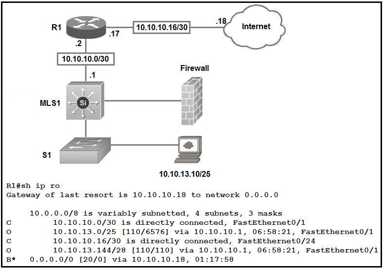
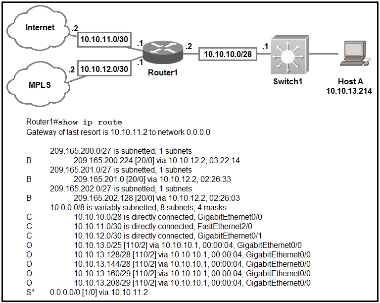
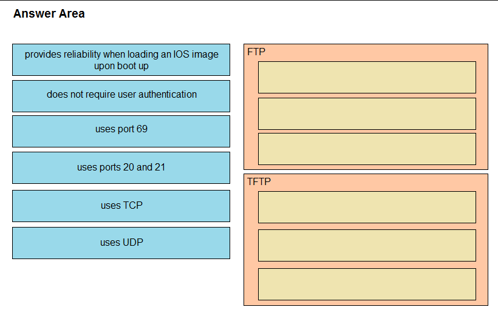

  
# CISOC - CCNA 200-301 - Exam  
  
  
  
## ExamTopics  
### https://www.examtopics.com/exams/cisco/200-301/view/1  
---------------------------------------------------  
  

  
Question #1

Refer to the exhibit. Which type of route does R1 use to reach host 10.10.13.10/32?  

  

A. default route  
B. network route  
C. host route  
D. floating static route  

Réf:  
https://www.econfigs.com/ccna-3-8-b-network-route/  
A network route is used to route traffic to a specific network.  
The network mask in a network route cannot be /0 (default route) or /32 (host route).  

  

    
🌟 Correct Answer

    ✅ B
  

---

  
Question #2

Refer to the exhibit. Which prefix does Router1 use for traffic to Host A?  

  

A. 10.10.10.0/28  
B. 10.10.13.0/25  
C. 10.10.13.144/28  
D. 10.10.13.208/29  

  

    
🌟 Correct Answer

    ✅ D
  

---

  
Question #3

Drag and drop the IPv4 network subnets from the left onto the correct usable host ranges on the right. Select and Place:  

  

  

    
🌟 Correct Answer

    ✅ A B C D E
  

---
  

  
Question #N?

  

    
🌟 Correct Answer

    ✅ A B C D E
  

---

  
Question #N?

  

    
🌟 Correct Answer

    ✅ A B C D E
  

---

  
Question #N?

  

    
🌟 Correct Answer

    ✅ A B C D E
  

---

  
Question #N?

  

    
🌟 Correct Answer

    ✅ A B C D E
  

---

  
Question #N?

  

    
🌟 Correct Answer

    ✅ A B C D E
  

---

  
Question #N?

  

    
🌟 Correct Answer

    ✅ A B C D E
  

---

  
Question #N?

  

    
🌟 Correct Answer

    ✅ A B C D E
  

---

  
Question #N?

  

    
🌟 Correct Answer

    ✅ A B C D E
  

---

  
Question #N?

  

    
🌟 Correct Answer

    ✅ A B C D E
  

---

  
Question #N?

  

    
🌟 Correct Answer

    ✅ A B C D E
  

---

  
Question #N?

  

    
🌟 Correct Answer

    ✅ A B C D E
  

---

  
Question #N?

  

    
🌟 Correct Answer

    ✅ A B C D E
  

---

  
Question #N?

  

    
🌟 Correct Answer

    ✅ A B C D E
  

---

  
Question #N?

  

    
🌟 Correct Answer

    ✅ A B C D E
  

---

  
Question #N?

  

    
🌟 Correct Answer

    ✅ A B C D E
  

---

  
Question #N?

  

    
🌟 Correct Answer

    ✅ A B C D E
  

---

  
Question #N?

  

    
🌟 Correct Answer

    ✅ A B C D E
  

---

  
Question #N?

  

    
🌟 Correct Answer

    ✅ A B C D E
  

---

  
Question #N?

  

    
🌟 Correct Answer

    ✅ A B C D E
  

---

  
Question #N?

  

    
🌟 Correct Answer

    ✅ A B C D E
  

---

  
Question #N?

  

    
🌟 Correct Answer

    ✅ A B C D E
  

---

  
Question #N?

  

    
🌟 Correct Answer

    ✅ A B C D E
  

---

  
Question #N?

  

    
🌟 Correct Answer

    ✅ A B C D E
  

---

  
Question #N?

  

    
🌟 Correct Answer

    ✅ A B C D E
  

---

  
Question #N?

  

    
🌟 Correct Answer

    ✅ A B C D E
  

---

  
Question #N?

  

    
🌟 Correct Answer

    ✅ A B C D E
  

---

  
Question #N?

  

    
🌟 Correct Answer

    ✅ A B C D E
  

---

  
Question #N?

  

    
🌟 Correct Answer

    ✅ A B C D E
  

---

  
Question #N?

  

    
🌟 Correct Answer

    ✅ A B C D E
  

---

  
Question #N?

  

    
🌟 Correct Answer

    ✅ A B C D E
  

---

  
Question #N?

  

    
🌟 Correct Answer

    ✅ A B C D E
  

---

  
Question #N?

  

    
🌟 Correct Answer

    ✅ A B C D E
  

---

  
Question #N?

  

    
🌟 Correct Answer

    ✅ A B C D E
  

---

  
Question #N?

  

    
🌟 Correct Answer

    ✅ A B C D E
  

---

  
Question #N?

  

    
🌟 Correct Answer

    ✅ A B C D E
  

---

  
Question #N?

  

    
🌟 Correct Answer

    ✅ A B C D E
  

---

  
Question #N?

  

    
🌟 Correct Answer

    ✅ A B C D E
  

---

  
Question #N?

  

    
🌟 Correct Answer

    ✅ A B C D E
  

---

  
Question #N?

  

    
🌟 Correct Answer

    ✅ A B C D E
  

---

  
Question #N?

  

    
🌟 Correct Answer

    ✅ A B C D E
  

---

  
Question #N?

  

    
🌟 Correct Answer

    ✅ A B C D E
  

---

  
Question #N?

  

    
🌟 Correct Answer

    ✅ A B C D E
  

---

  
Question #N?

  

    
🌟 Correct Answer

    ✅ A B C D E
  

---

  
Question #N?

  

    
🌟 Correct Answer

    ✅ A B C D E
  

---

  
Question #N?

  

    
🌟 Correct Answer

    ✅ A B C D E
  

---

  
Question #N?

  

    
🌟 Correct Answer

    ✅ A B C D E
  

---

  
Question #N?

  

    
🌟 Correct Answer

    ✅ A B C D E
  

---

  
Question #N?

  

    
🌟 Correct Answer

    ✅ A B C D E
  

---

  
Question #N?

  

    
🌟 Correct Answer

    ✅ A B C D E
  

---

  
Question #N?

  

    
🌟 Correct Answer

    ✅ A B C D E
  

---

  
Question #N?

  

    
🌟 Correct Answer

    ✅ A B C D E
  

---

  
Question #N?

  

    
🌟 Correct Answer

    ✅ A B C D E
  

---

  
Question #N?

  

    
🌟 Correct Answer

    ✅ A B C D E
  

---

  
Question #N?

  

    
🌟 Correct Answer

    ✅ A B C D E
  

---

  
Question #N?

  

    
🌟 Correct Answer

    ✅ A B C D E
  

---

  
Question #N?

  

    
🌟 Correct Answer

    ✅ A B C D E
  

---

  
Question #N?

  

    
🌟 Correct Answer

    ✅ A B C D E
  

---

  
Question #N?

  

    
🌟 Correct Answer

    ✅ A B C D E
  

---

